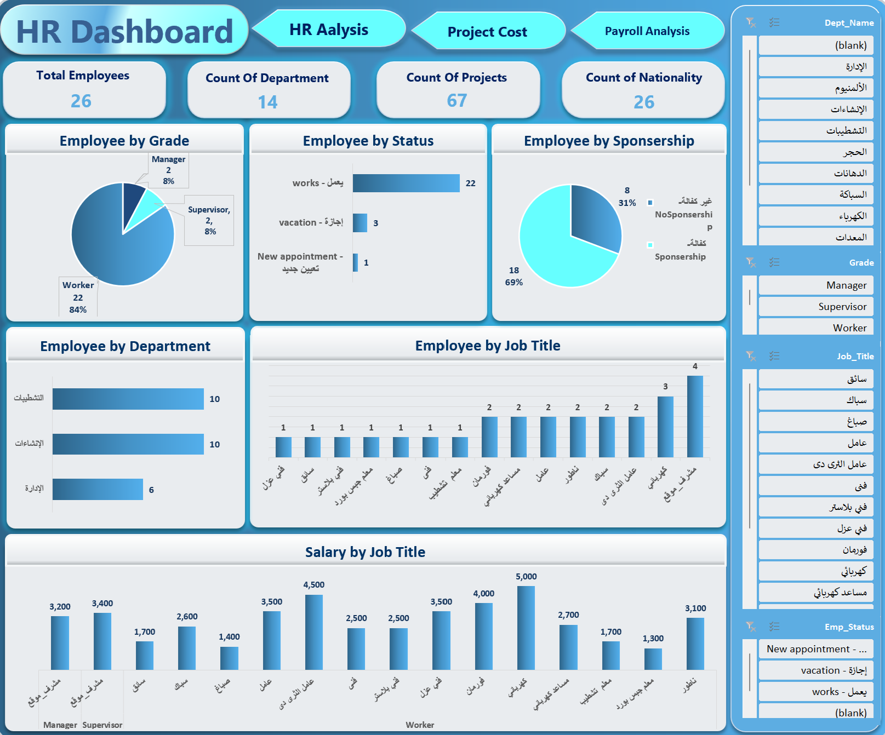
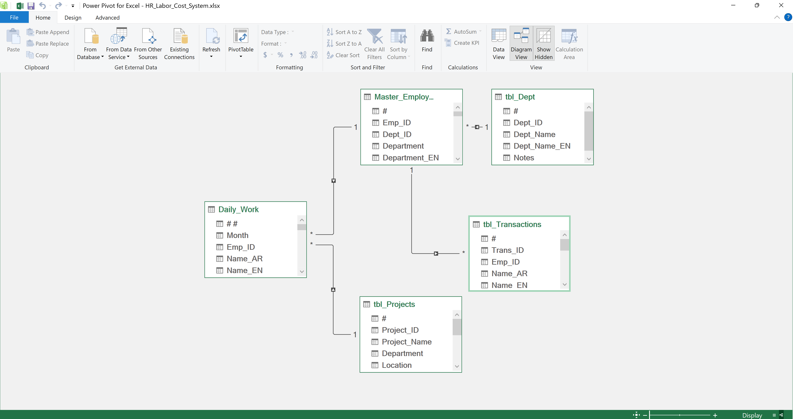
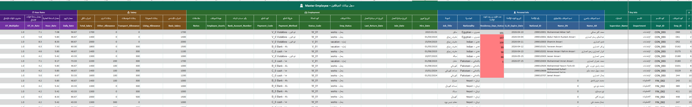
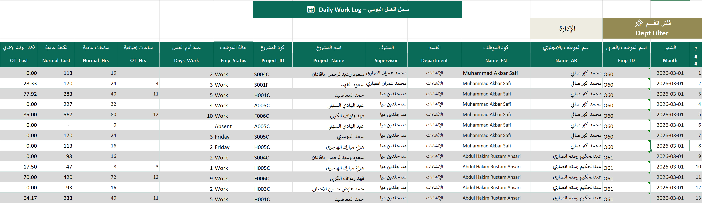
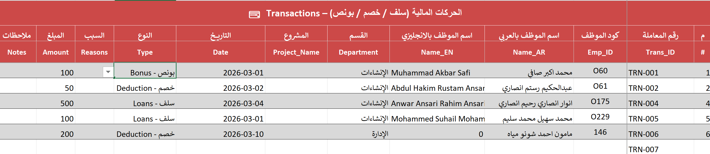

# Construction Workforce & Project Cost Analytics System

**An end-to-end workforce, payroll, and project cost management system built with Excel, Power Pivot, and DAX, transforming daily attendance records into automated payroll calculations, labor cost allocation, and executive analytics.**

---

## Project Snapshot

| Metric | Value |
|----------|----------|
| Departments Managed | 10 |
| Connected Tables | 5 |
| DAX Measures | 20+ |
| Executive Dashboards | 3 |
| Core Functions | Workforce, Payroll & Project Costing |
| Platform | Excel + Power Pivot + DAX |

---

# Dashboard Gallery

## HR Analytics Dashboard



---

## Payroll Analysis Dashboard


---

## Project Cost Analysis Dashboard


---

# Data Model

The solution is powered by a centralized Power Pivot data model that integrates employees, projects, attendance records, payroll transactions, and labor costs into a single source of truth.



The **Daily Work** table acts as the operational core of the system, driving both payroll calculations and project labor costing.

---

# Business Problem

The company managed workforce operations, payroll adjustments, attendance records, and project labor costs through disconnected spreadsheets, making it difficult to accurately calculate salaries, track project expenses, and generate management reports.

---

# Solution

Designed and developed a centralized operational system that connects:

- Employee Management
- Project Management
- Workforce Tracking
- Payroll Processing
- Project Cost Allocation
- Executive Reporting

All modules are integrated through a relational Power Pivot model and an automated DAX calculation engine.

---

# Core Modules

## Employee Master



Centralized employee database powering payroll calculations, workforce analytics, and project cost allocation.

---

## Daily Work Tracking



Operational core of the system used to calculate employee payroll, overtime costs, and project labor expenses.

---

## Payroll Transactions



Tracks bonuses, deductions, loans, and additional payments that automatically affect payroll calculations.

---

# DAX Calculation Engine

The business logic is powered by 20+ DAX measures built on top of the Power Pivot model.

### Net Salary

```DAX
Net Salary =
[Total Work Cost]
+ [Total Bonus]
+ [Total Addition]
- [Total Deductions]
- [Total Loans]
```

### Project Cost

```DAX
Project Cost =
SUMX(
    Daily_Work,
    Daily_Work[Days_Work] *
    RELATED(Master_Employee[Daily_Rate])
    +
    Daily_Work[OT_Hrs] *
    RELATED(Master_Employee[OT_Hr_Rate])
)
```

### OT Cost

```DAX
OT Cost =
SUMX(
    Daily_Work,
    Daily_Work[OT_Hrs] *
    RELATED(Master_Employee[OT_Hr_Rate])
)
```

### Previous Month Salary

```DAX
Previous Month Salary =
CALCULATE(
    [Net Salary],
    DATEADD(
        Daily_Work[Month],
        -1,
        MONTH
    )
)
```

### Additional KPIs

- Employee Count
- Workers Count
- Avg Salary
- Max Salary
- Min Salary
- Absence Rate
- Cost per Worker
- Total Work Days
- Total OT Hours
- Payroll Trends
- Bonus Analysis
- Deduction Analysis

---
# Business Impact

- Automated payroll calculations from attendance and overtime records.
- Automated allocation of labor costs to projects and departments.
- Eliminated manual payroll reconciliation and cost tracking.
- Centralized workforce, payroll, and project data in one system.
- Enabled real-time operational reporting through executive dashboards.
- Improved management visibility across projects, departments, and workforce performance.
